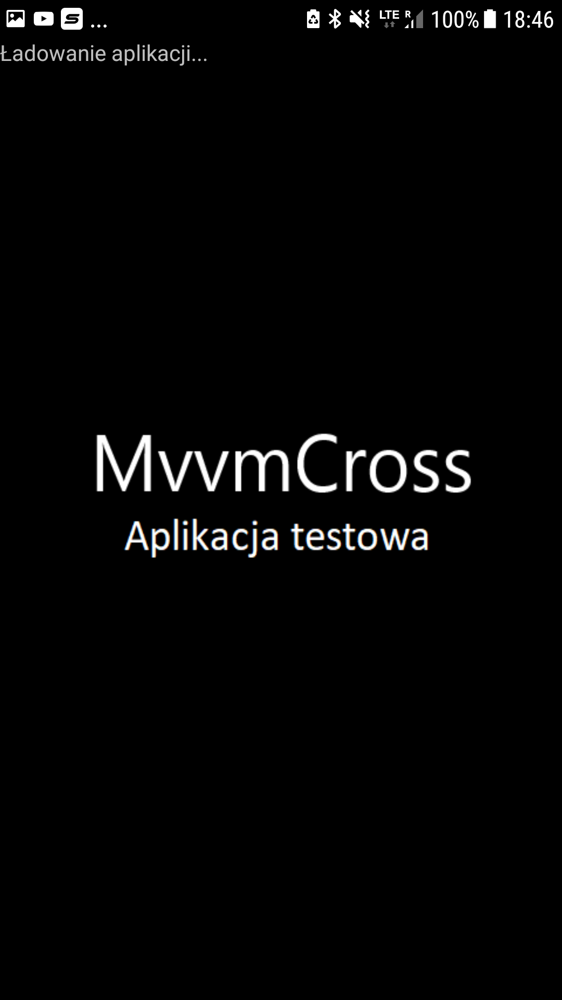
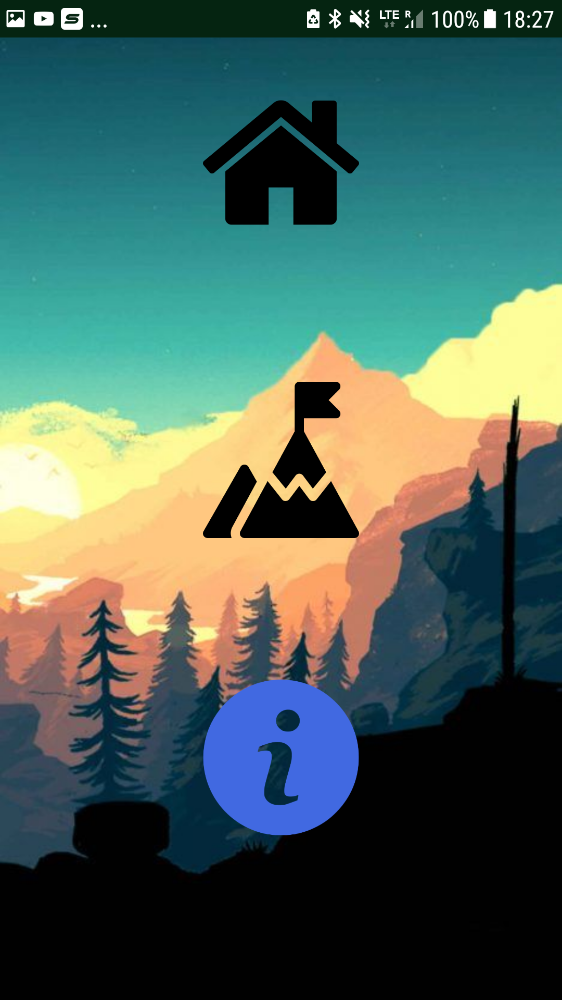
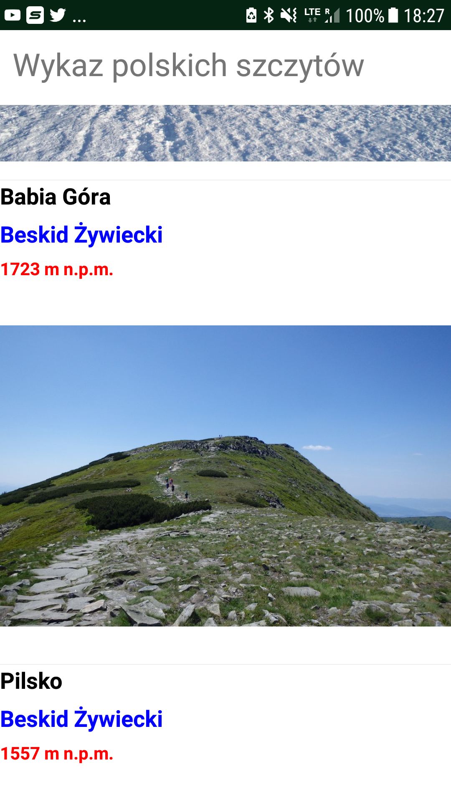

# Aplikacja testowa MVVMCross Xamarin.Forms

## Technologie
* C#
* Xamarin.Forms

## Wykorzystane bibiloteki
* <PackageReference Include="CarouselView.FormsPlugin" Version="5.2.0" />
* <PackageReference Include="MvvmCross" Version="6.1.2" />
* <PackageReference Include="MvvmCross.Forms" Version="6.1.2" />
* <PackageReference Include="Newtonsoft.Json" Version="11.0.2" />
* <PackageReference Include="PropertyChanged.Fody" Version="2.6.0" />
* <PackageReference Include="Rg.Plugins.Popup" Version="1.1.4.168" />
* <PackageReference Include="Xamarin.Essentials" Version="1.3.1" />
* <PackageReference Include="Xamarin.FFImageLoading.Forms" Version="2.4.11.982" />
* <PackageReference Include="Xamarin.Forms" Version="4.2.0.848062" />

## Zrzuty ekranu działającej aplikacji

## Źródła
* Darmowe ikony ze strony https://www.flaticon.com
* Dane dotyczące aplikacji ze strony https://www.ciekawe-miejsca.net/przewodnik/polska/najwybitniejsze_szczyty_polski_cz_1
